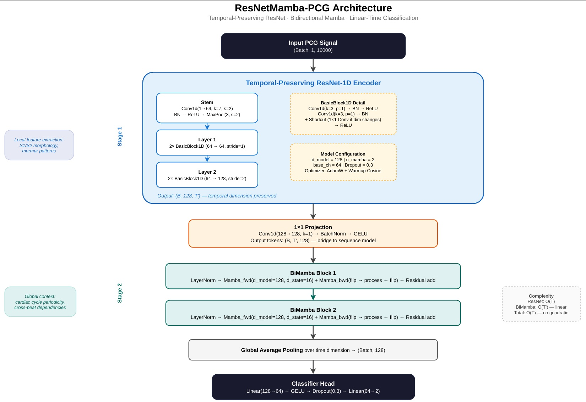
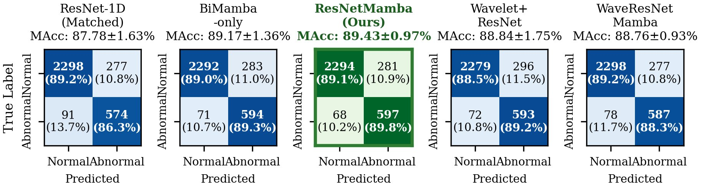

# ResNetMamba-PCG

**Bidirectional State Space Modeling for Phonocardiogram Classification**

[](https://ieeexplore.ieee.org/)
[](LICENSE)
[](https://www.python.org/)
[](https://pytorch.org/)

> **ResNetMamba-PCG** introduces bidirectional Mamba (selective state space models) to phonocardiogram classification for the first time. A capacity-matched ablation study demonstrates that Mamba is the dominant performance driver, and combining it with a temporal-preserving ResNet-1D yields the best accuracy with the lowest cross-fold variance.

<p align="center">
  
</p>

---

## Key Results

All results are from **5-fold stratified cross-validation** (seed=42) on the [PhysioNet/CinC 2016](https://physionet.org/content/challenge-2016/1.0.0/) dataset (3,240 recordings).

| Model | CNN | SSM | Se (%) | Sp (%) | MAcc (%) |
|:------|:---:|:---:|-------:|-------:|---------:|
| ResNet-1D (matched) | ✓ | | 86.32±3.41 | 89.24±1.61 | 87.78±1.63 |
| BiMamba-only | | ✓ | 89.32±2.49 | 89.01±3.04 | 89.17±1.36 |
| **ResNetMamba (Ours)** | **✓** | **✓** | **89.77±1.55** | **89.09±2.57** | **89.43±0.97** |
| Wavelet+ResNet | ✓ | | 89.17±2.67 | 88.50±2.57 | 88.84±1.75 |
| WaveResNetMamba | ✓ | ✓ | 88.27±3.88 | 89.24±2.32 | 88.76±0.93 |

<p align="center">
  
</p>

### Key Findings

1. **Bidirectional Mamba is the dominant contributor** — BiMamba-only (89.17%) surpasses the matched ResNet baseline (87.78%) by +1.39 pp
2. **CNN features stabilise predictions** — ResNetMamba achieves the lowest fold-to-fold variance (±0.97%)
3. **Fixed wavelet decomposition does not help** — Mamba's selective gating implicitly learns frequency-dependent filtering

---

## Architecture

ResNetMamba-PCG is a two-stage hybrid:

```
Raw PCG (B, 1, 16000)  [2 kHz, 8 seconds]
        │
  Stage 1: Temporal-Preserving ResNet-1D
  ├── Stem: Conv1d(1→64, k=7, s=2) + BN + ReLU + MaxPool
  ├── Layer 1: 2× BasicBlock1D (64→64, stride=1)
  └── Layer 2: 2× BasicBlock1D (64→128, stride=2)
        │  Output: (B, 128, T') — no global pooling
        │
  1×1 Projection → (B, T', 128)
        │
  Stage 2: Stacked Bidirectional Mamba (×2)
  ├── LayerNorm → Mamba_fwd + Mamba_bwd(flip) → Residual
  └── d_model=128, d_state=16, d_conv=4, expand=2
        │
  Global Average Pooling → (B, 128)
        │
  Classifier: Linear(128→64) → GELU → Dropout(0.3) → Linear(64→2)
```

---

## Installation

### Prerequisites
- Python ≥ 3.10
- PyTorch ≥ 2.0
- CUDA ≥ 11.8 (recommended for mamba-ssm)

### Setup

```bash
# Clone the repository
git clone https://github.com/zakineili/ResNetMamba-PCG.git
cd ResNetMamba-PCG

# Create conda environment
conda create -n resnetmamba python=3.10 -y
conda activate resnetmamba

# Install dependencies
pip install -r requirements.txt

# Install mamba-ssm (CUDA required, Linux only)
pip install mamba-ssm --no-build-isolation

# If mamba-ssm fails (Windows/CPU), the code automatically
# falls back to a pure-PyTorch reference implementation
```

### Download the Dataset

```bash
# Option 1: Manual download from PhysioNet
# https://physionet.org/content/challenge-2016/1.0.0/
# Extract to: data/physionet2016/training-a/ ... training-f/

# Option 2: Using the download script
bash scripts/download_data.sh
```

---

## Usage

### Reproduce All Results (5-Fold Cross-Validation)

```bash
# 1. ResNet-1D baseline (capacity-matched)
python scripts/cross_validate.py --model resnet1d_matched \
    --data data/physionet2016 --output results/cv_resnet_matched.json

# 2. BiMamba-only
python scripts/cross_validate.py --model mamba_pcg \
    --data data/physionet2016 --output results/cv_mamba_pcg.json

# 3. ResNetMamba (proposed — best model)
python scripts/cross_validate.py --model resnet_mamba \
    --data data/physionet2016 --output results/cv_resnet_mamba.json

# 4. Wavelet+ResNet (ablation)
python scripts/cross_validate.py --model wavelet_resnet \
    --data data/physionet2016 --output results/cv_wavelet_resnet.json

# 5. WaveResNetMamba (ablation)
python scripts/cross_validate.py --model wave_resnet_mamba \
    --data data/physionet2016 --output results/cv_wavemamba.json
```

### McNemar's Test

```bash
python scripts/cross_validate.py --mcnemar \
    --baseline results/cv_resnet_matched.json \
    --proposed results/cv_resnet_mamba.json
```

### Single Training Run

```bash
python scripts/train_resnet.py --data data/physionet2016
python scripts/train_wavemamba.py --data data/physionet2016
```

---

## Project Structure

```
ResNetMamba-PCG/
├── models/
│   ├── __init__.py              # Model registry & build_model()
│   ├── resnet1d.py              # ResNet-1D full baseline
│   ├── resnet1d_matched.py      # Capacity-matched ResNet-1D
│   ├── mamba_pcg.py             # BiMamba-only (SSM baseline)
│   ├── resnet_mamba.py          # ResNetMamba (proposed)
│   ├── wavelet_resnet1d.py      # Wavelet+ResNet (ablation)
│   ├── wave_resnet_mamba.py     # WaveResNetMamba (ablation)
│   └── mamba_ref.py             # Pure-PyTorch Mamba fallback
├── scripts/
│   ├── cross_validate.py        # 5-fold CV + McNemar's test
│   ├── prepare_data.py          # Raw WAV → preprocessed NPY
│   ├── train_resnet.py          # Single-run ResNet training
│   ├── train_wavelet_resnet.py  # Single-run WaveletResNet
│   └── train_wavemamba.py       # Single-run WaveResNetMamba
├── utils/
│   ├── dataset.py               # PhysioNet2016 dataset loader
│   ├── metrics.py               # MAcc, Se, Sp, McNemar's test
│   └── trainer.py               # Training utilities
├── configs/
│   └── default.yaml             # Hyperparameter config
├── figures/                     # Architecture & result figures
├── results/                     # CV results (JSON) & checkpoints
├── requirements.txt
├── environment.yml
├── LICENSE
└── README.md
```

---

## Models

| Model | File | Description | Params |
|:------|:-----|:------------|-------:|
| ResNet-1D (full) | `resnet1d.py` | 4-layer ResNet, 512ch | 3.84M |
| ResNet-1D (matched) | `resnet1d_matched.py` | 2-layer ResNet, 64ch | 60K |
| BiMamba-only | `mamba_pcg.py` | Patch embed + 2× BiMamba | 624K |
| **ResNetMamba** | **`resnet_mamba.py`** | **ResNet + 2× BiMamba** | **723K** |
| Wavelet+ResNet | `wavelet_resnet1d.py` | DWT + dual ResNet + fusion | 555K |
| WaveResNetMamba | `wave_resnet_mamba.py` | DWT + dual ResNet + BiMamba | 609K |

---

## Citation

If you find this work useful, please cite:

```bibtex
@article{neili2025resnetmamba,
  title   = {ResNetMamba-PCG: Bidirectional State Space Modeling
             for Phonocardiogram Classification},
  author  = {Neili, Zakaria and Sundaraj, Kenneth},
  journal = {IEEE Signal Processing Letters},
  year    = {2025},
  note    = {Under review}
}
```

---

## Acknowledgments

- [PhysioNet/CinC Challenge 2016](https://physionet.org/content/challenge-2016/1.0.0/) for the open-access dataset
- [Mamba](https://github.com/state-spaces/mamba) by Albert Gu and Tri Dao
- [pytorch_wavelets](https://github.com/fbcotter/pytorch_wavelets) by Fergal Cotter

---

## License

This project is licensed under the MIT License — see [LICENSE](LICENSE) for details.
